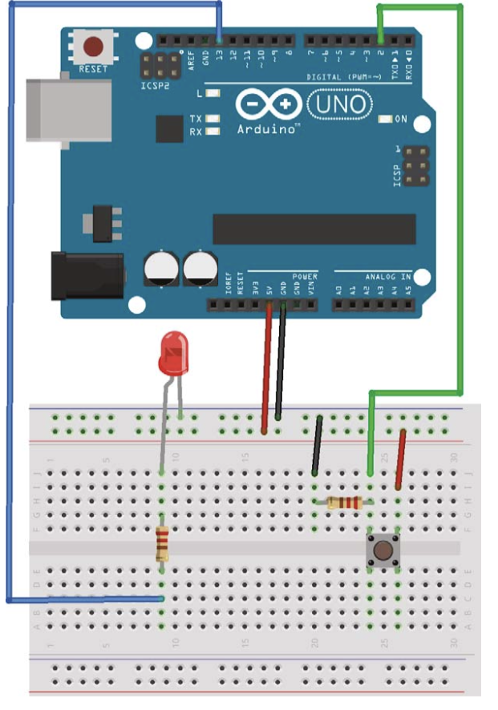

# Pushbutton-Controlled LED

This project demonstrates how to control an LED using a momentary pushbutton switch. When the button is pressed, the LED toggles between ON and OFF states. The code includes debouncing logic to handle mechanical noise from the pushbutton.

## Components Required

- Arduino Board
- Breadboard
- Jumper Wires
- LED
- Momentary Tactile Pushbutton (4-pin)
- 10kΩ Resistor (for pull-down)
- 220Ω Resistor (for current limiting)

## Circuit Diagram

### Pushbutton Configuration:
The pushbutton has four pins, but only two are used in this project. When the button is pressed, it completes the circuit, allowing current to flow, which toggles the LED. The button acts as a momentary switch, meaning it only stays on while pressed.

### LED Configuration:
The LED is connected to an output pin on the Arduino, and a 220Ω resistor is placed in series to limit the current.

### Circuit Build:
1. Place the pushbutton on the breadboard.
2. Connect pin A of the pushbutton to one leg of the 10kΩ resistor and Arduino pin 2. Connect the other leg of the resistor to the GND rail on the breadboard.
3. Connect pin B of the pushbutton to the +5V rail.
4. Add the LED to the breadboard: connect the longer (positive) leg to Arduino pin 12 via a 220Ω resistor and the shorter (negative) leg to the GND rail.

## How It Works

- When the button is pressed, the circuit is completed, and the Arduino detects a HIGH signal on pin 2.
- The code uses a **debouncing** mechanism to prevent noise from the button press. This ensures that the button press is registered only once even if there is mechanical bounce.
- The LED is **toggled** between ON and OFF states each time the button is pressed, instead of just turning ON while pressed and OFF when released.
  
This type of pushbutton is also known as a momentary switch, commonly used in keyboards and other electronic devices.

## Improvements

- **Debouncing**: A software debounce mechanism is implemented to handle mechanical noise from the pushbutton. This prevents multiple button presses from being accidentally registered.
- **LED Toggling**: Instead of simply turning the LED on or off based on button state, the LED now toggles between ON and OFF with each button press, making the behavior more interactive and user-friendly.

## Instructions to Run the Project

1. Build the circuit as described in the circuit build section.
2. Connect the Arduino to your computer using a USB cable.
3. Open the Arduino IDE and upload the provided code.
4. Press the button to toggle the LED between ON and OFF states.
